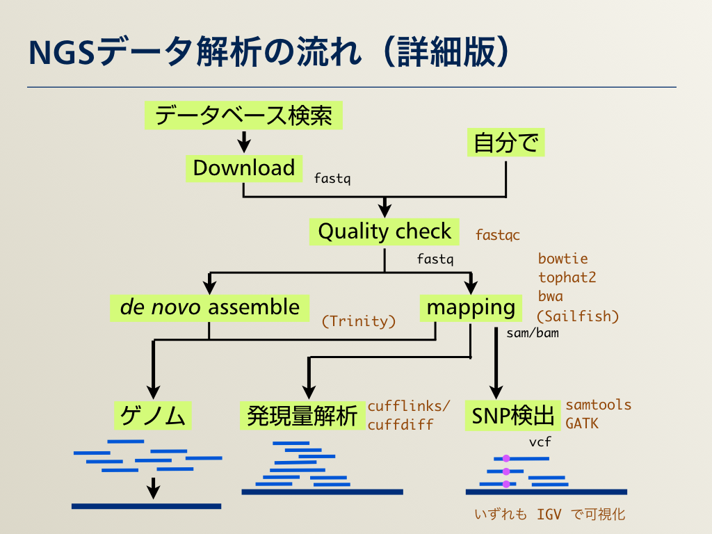

## AJACS尾張
# 次世代シーケンサー（NGS）解析・実践編：目的別データ解析

情報・システム研究機構（ROIS）  
データサイエンス共同利用基盤施設
ライフサイエンス統合データベースセンター（DBCLS）  
[仲里 猛留](http://data.dbcls.jp/~nakazato/)  
nakazato@dbcls.rois.ac.jp  
twitter: @chalkless

2017年2月1日 AJACS尾張@藤田保健衛生大学

----

[AJACS尾張](http://events.biosciencedb.jp/training/ajacs64/) > 次世代シーケンサー（NGS）解析・実践編：目的別データ解析

----

## 概略
  

## 参考リソース
  - 参考図書・その1 〜 実験もやる人向け
  - 参考図書・その2 〜 解析を詳しく
  - 詳細な解析をひととおり知りたい
  - 解析について詳細な情報を探したい
  - 解析環境・コマンドラインベース
  - 解析環境・ウェブベース

## 実際の解析1：クオリティチェック・トリミング

## 実際の解析2−1：発現解析（mapping）

## 実際の解析2−2：発現解析（de novo）

## 実際の解析2−3：その後の発現解析

## 実際の解析3−1：SNV/Indel解析

## 実際の解析3−2：ChIP-Seq

## 実際の解析3−3：メタゲノム

----

[AJACS尾張](http://events.biosciencedb.jp/training/ajacs64/) > 次世代シーケンサー（NGS）解析・実践編：目的別データ解析

----
