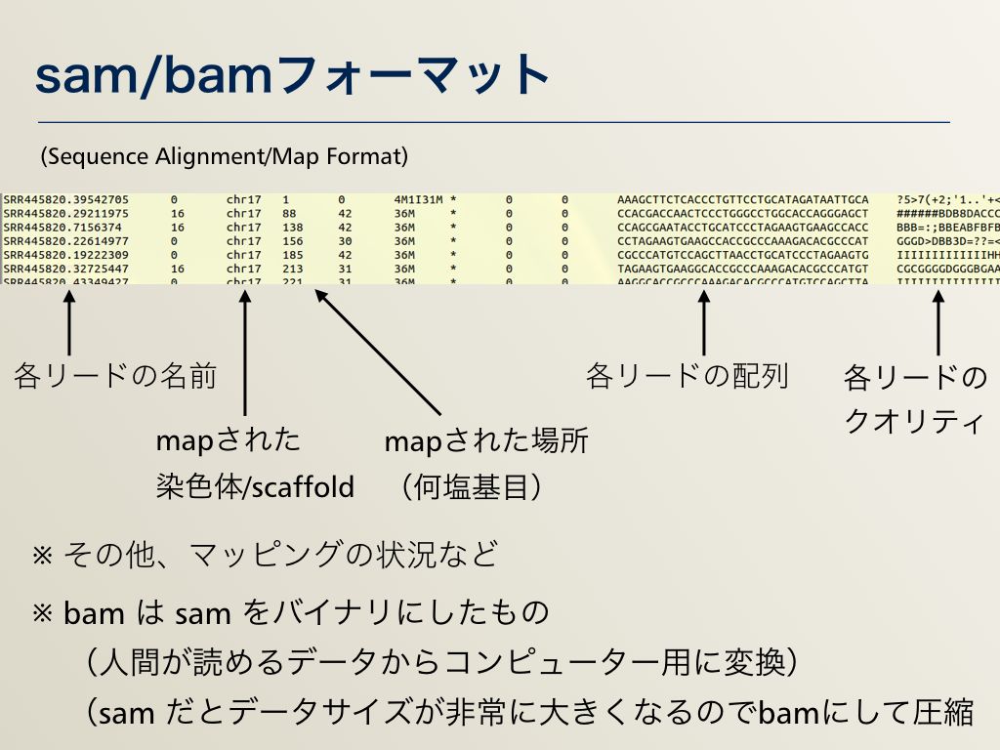

## AJACS尾張
# 次世代シーケンサー（NGS）解析・実践編：目的別データ解析

情報・システム研究機構（ROIS）  
データサイエンス共同利用基盤施設
ライフサイエンス統合データベースセンター（DBCLS）  
[仲里 猛留](http://data.dbcls.jp/~nakazato/)  
nakazato@dbcls.rois.ac.jp  
twitter: @chalkless

2017年2月1日 AJACS尾張@藤田保健衛生大学

----

[AJACS尾張](http://events.biosciencedb.jp/training/ajacs64/) > 次世代シーケンサー（NGS）解析・実践編：目的別データ解析

----

## 概略
  

## 参考リソース
  - 参考図書・その1 〜 実験もやる人向け
  - 参考図書・その2 〜 解析を詳しく
  - 詳細な解析をひととおり知りたい
  - 解析について詳細な情報を探したい
  - 解析環境・コマンドラインベース
  - 解析環境・ウェブベース

## 実際の解析1：クオリティチェック・トリミング
- クオリティチェックには主にFASTQCというツールが使われます。  
トリミングはさまざまなツールがあります（今回はtrim_galoreで例を示しています）

- 入力データ：FASTQフォーマット

    @DRR001107.1 GEZQ5FO01EEA7F length=77
    GCAACATTCAACACATATGTGTTGAATGTTGCACGACGGNGTGTCGCGTCTCTCAAGGCACACAGGGAGTAGNGNNN
    +DRR001107.1 GEZQ5FO01EEA7F length=77
    C@BBBECCECDBBBAAAAA<441111?=?????44!00044322====22--..//6998222<7<3/!/!!!

  - 1行目： @ + タイトル
  - 2行目：塩基配列
  - 3行目： + （+ タイトル）
  - 4行目：シーケンスクオリティ

- [参考] FASTAフォーマット

    > AB084425.1 eel SLC26A6
    GACCCAAAACTGATAGGTGATGTTCACGTAGTGGC
    CATCGCCTGATAGACGGTTTTCGCCCTTTGACGTT
    GGAGTCCACGTTCTTTAATAGTGACTCTGAGTAAA
    …

  - 1行目： > + タイトル
  - 2行目以降：塩基配列

- コマンド例
  - クオリティチェック

`$ fastqc --nogroup -o DRR1234567.fastq`

  - トリミング

`trim_galore --paired --illumina --fastqc -o trimmed/ DRR1234567.R1.fastq DRR1234567.R2.fastq`

  - 結果例

  

  - 今回、発現解析のところで用いるデータ（デスクトップ＞AJACS_OWARI）の中にも実際のものがあります
  - DBCLS SRAではあらかじめFastQCをかけた結果を表示できるように随時、処理をしています（自分でやらなくてよい！）
    - 例： http://sra.dbcls.jp/search/view/SRR067385

## 実際の解析2−1：発現解析（mapping）

- ゲノムなどのリファレンス配列にNGSデータをマッピングします
- bowtie、tophat2などなどさまざまなツールがあります
  - 発現解析程度なら速度重視、SNP解析なら精度重視とツールも変わります
  - 名前が違うだけで、中身は複数のツールの組み合わせということも多々あります
- コマンド例：マッピング

`tophat -p 2 -G annotation.gtf -o results/ Human.genome.fasta DRR1234567.trimmed.fasta`

- 結果：sam/bamフォーマット

- コマンド例：形式変換
  - マッピングはsam形式かbam形式で出力されます  
  samは人間が読めるがサイズが大きいです。bamはプログラムで扱えるように（サイズを小さくするためにも）なっていますが人間には読めません

`samtools view -Sb SRR1294107.sam -o SRR1294107.bam` （SAMからBAMへの変換）

`samtools view -h SRR1294107.bam -o SRR1294107.sam` （BAMからSAMへの変換）

## 実際の解析2−2：発現解析（de novo）

## 実際の解析2−3：その後の発現解析

## 実際の解析3−1：SNV/Indel解析

## 実際の解析3−2：ChIP-Seq

## 実際の解析3−3：メタゲノム

----

[AJACS尾張](http://events.biosciencedb.jp/training/ajacs64/) > 次世代シーケンサー（NGS）解析・実践編：目的別データ解析

----
