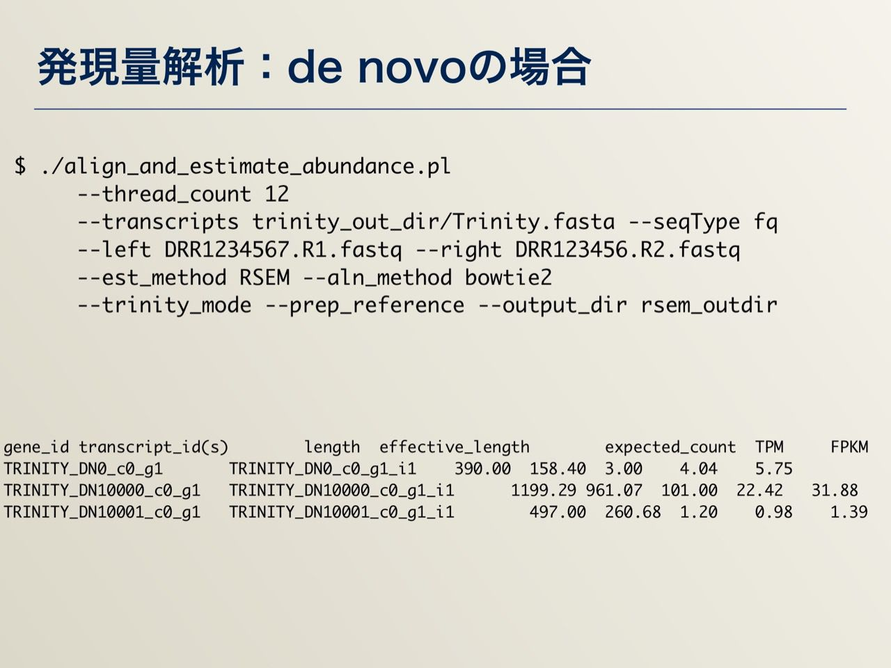

## AJACS尾張
# 次世代シーケンサー（NGS）解析・実践編：目的別データ解析

情報・システム研究機構（ROIS）  
データサイエンス共同利用基盤施設
ライフサイエンス統合データベースセンター（DBCLS）  
[仲里 猛留](http://data.dbcls.jp/~nakazato/)  
nakazato@dbcls.rois.ac.jp  
twitter: @chalkless

2017年2月1日 AJACS尾張@藤田保健衛生大学

----

[AJACS尾張](http://events.biosciencedb.jp/training/ajacs64/) > 次世代シーケンサー（NGS）解析・実践編：目的別データ解析

----

## 概略
  []()

## 参考リソース
  - 参考図書・その1 〜 実験もやる人向け
    []()

  - 参考図書・その2 〜 解析を詳しく
    []()

  - 詳細な解析をひととおり知りたい
    []()
    https://biosciencedbc.jp/human/human-resources/workshop/h28-2

  - 解析について詳細な情報を探したい
    []()
    http://www.iu.a.u-tokyo.ac.jp/~kadota/r_seq.html

  - 解析環境・コマンドラインベース
    []()
    http://www.iu.a.u-tokyo.ac.jp/~kadota/r_seq.html#bioinfo_ngs_sokushu_2016_20160719

  - 解析環境・ウェブベース
    []()
    http://p.ddbj.nig.ac.jp/


## 実際の解析1：クオリティチェック・トリミング
- クオリティチェックには主にFASTQCというツールが使われます。  
トリミングはさまざまなツールがあります（今回はtrim_galoreで例を示しています）

- 入力データ：FASTQフォーマット
[]()

- [参考] FASTAフォーマット
[]()

- 場合によっては（NCBIからダウンロードしたときなど）サイズ削減などのため、sra形式で圧縮されている場合があります。そのときはsra-toolkitでFASTQファイルを取り出したりします

- コマンド例
  - クオリティチェック

`$ fastqc --nogroup -o DRR1234567.fastq`

  - トリミング

`trim_galore --paired --illumina --fastqc -o trimmed/ DRR1234567.R1.fastq DRR1234567.R2.fastq`

  - 結果例

  []()

  - HTMLファイルができると思ってください
  - 今回、発現解析のところで用いるデータ（デスクトップ＞AJACS_OWARI）の中にも実際のものがあります
  - DBCLS SRAではあらかじめFastQCをかけた結果を表示できるように随時、処理をしています（自分でやらなくてよい！）
    - 例： http://sra.dbcls.jp/search/view/SRR067385


## 実際の解析2−1：発現解析（mapping）

- ゲノムなどのリファレンス配列にNGSデータをマッピングします
- bowtie、tophat2などなどさまざまなツールがあります
  - 発現解析程度なら速度重視、SNP解析なら精度重視とツールも変わります
  - 名前が違うだけで、中身は複数のツールの組み合わせということも多々あります
- コマンド例：マッピング

`tophat -p 2 -G annotation.gtf -o results/ Human.genome.fasta DRR1234567.trimmed.fasta`

- 結果：sam/bamフォーマット

[]()


- コマンド例：形式変換
  - マッピングはsam形式かbam形式で出力されます  
  samは人間が読めるがサイズが大きいです。bamはプログラムで扱えるように（サイズを小さくするためにも）なっていますが人間には読めません

`samtools view -Sb SRR1294107.sam -o SRR1294107.bam` （SAMからBAMへの変換）

`samtools view -h SRR1294107.bam -o SRR1294107.sam` （BAMからSAMへの変換）

## 実際の解析2−2：発現解析（de novo）
- 特に非モデル生物を扱う場合など、ゲノム情報がない場合は、RNA-Seqの発現データをリードだけでつなぎtranscriptを得る
- Trinity を用いる

- コマンド例

`$ Trinity --seqType fq --left DRR1234567.R1.fastq --right DRR1234567.R2.fastq --max_memory 24G --CPU 16`

- 結果例

```
$ head trinity_out_dir/Trinity.fasta
>TRINITY_DN0_c0_g1_i1 len=390 path=[735:0-389] [-1, 735, -2]
AAACTTCATAGATGAAATAAATGCTCATATACTATGTAGAAAATCTCCACATATATAAAA
CAAAACATTTTGCTTTAAAACAGATATGATCACTAGGTGCAATGGCCTAATTCCCTGGCT
…
```
-DNxxx_cXXX がクラスタとしてまとまったもの。-gXXXの部分が遺伝子、_iXXXがisoformに対応


## 実際の解析2−3：その後の発現解析
- 発現量解析
- 遺伝子機能アノテーション
  - BLASTで類似性のある遺伝子を検索
  - hmmerでドメインサーチ
  - → Trinityの関連でのアノテーションづけのページが非常に役立つ  
  https://trinotate.github.io/

## 実際の解析3−1：SNV/Indel解析
- 基本的にはmappingと同様。ただし、1塩基のずれも重要なので（場合によってはmappingでのツールで大雑把にアラインメントをとった後）精度重視でのmappingを行う。  
その後、variantの解析を行う。

- 結果：vcfデータ（variant call format）
[]()

## 実際の解析3−2：ChIP-Seq


## 実際の解析3−3：メタゲノム


----

[AJACS尾張](http://events.biosciencedb.jp/training/ajacs64/) > 次世代シーケンサー（NGS）解析・実践編：目的別データ解析

----
## Slides

---


---


---


---


---


---


---


---


---


---


---


---


---


---


---


---


---


---


---


---


---


---


---


---


---


---


---


---


---


---


---


---


---


---


---


---


---
